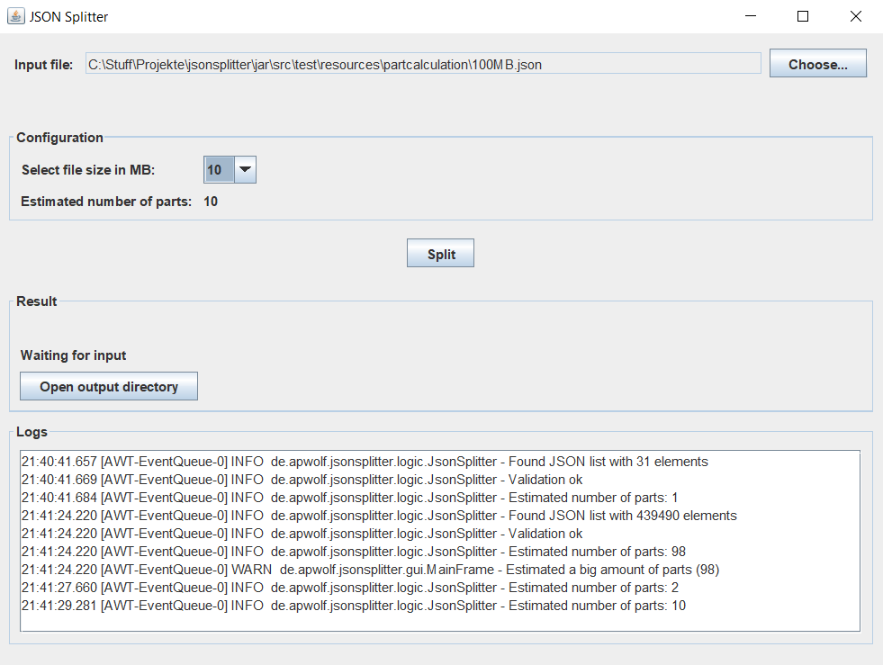

A Kotlin project with Swing GUI to split a file containing a JSON array into smaller files.

Works fine but I abandoned it because I couldn't find a nice way to make it a native application. Kotlin Native does not support nice convenience, jlink does not work with the used dependencies and JLaunch creates a huge application. 

Maybe one day I will come back to it :)

To launch just execute the main() in Main.kt.

Looks like this:
